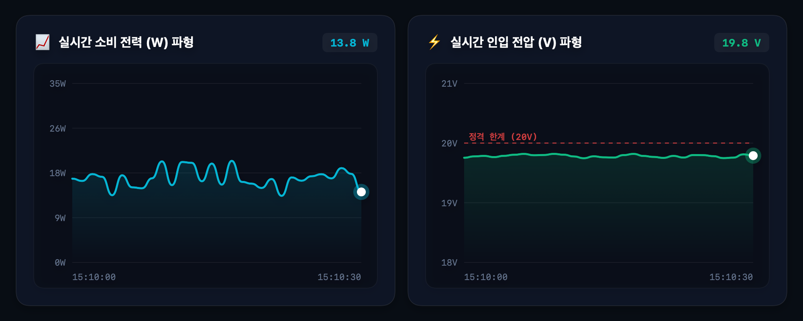

# ⚡ Mac Power Guard

<div align="center">


### 실시간 전력 공급량 & 하드웨어 전원선 안전 진단 시스템
**Real-time Power Telemetry, Waveform Monitor & Safety Diagnosis System for macOS**

[](https://apple.com)
[](https://swift.org)
[]()
[]()

</div>

---

## 📌 개요 (Overview)

**Mac Power Guard**는 Apple Silicon 및 Intel Mac의 IOKit 내부 전원 버스 텔레메트리(`AppleSmartBattery`, `PowerTelemetryData`)를 초당 수 회 직접 추출하여, **충전기 및 USB-C 케이블의 노후화, 급격한 전압 강하(Voltage Drop), 접촉 불량 및 과부하 위험**을 실시간으로 감지하고 시각화하는 고성능 macOS 네이티브 시스템 유틸리티입니다.

외부 백엔드 서버나 복잡한 런타임 설정 없이 **더블클릭 한 번으로 100% 네이티브 GUI 앱**을 실행할 수 있으며, CLI 및 웹 대시보드(PWA) 모드도 함께 제공합니다.

---

## 📸 스크린샷 (Screenshots)

<div align="center">
  
  <p><em>▲ 실시간 소비 전력(W) & 인입 전압(V) Metal 가속 실시간 베지에 파형</em></p>
</div>

---

## ✨ 핵심 기능 (Key Features)

### 1. 📈 Metal 가속 실시간 베지에 파형 차트 (Canvas 2D)
- **SwiftUI `Canvas` 기반 60FPS 렌더링**: CPU 점유율 0.2% 미만의 극저부하 렌더링
- **스마트 전압 타겟 오토스케일링**:
  - 20V 충전기 환경에서 `18.0V ~ 21.0V` 최적 범위로 고정하여 19.8V 실측 파형을 황금비율(60% 높이)로 렌더링
  - 어댑터 정격 전압(`20V`)에 맞춘 **레드 대시 정격 한계선** 표시
  - 일시적 비정상 데이터(0V) 유입에 의한 차트 찌그러짐 및 하단 늘어짐 완벽 방지
- **사이버펑크 네온 비주얼**: 부드러운 큐빅 베지에 스무딩, 수직 알파 그라데이션 및 글로잉 헤드 닷(Glowing Head Dot)

### 2. 🛡️ 4대 위험 징후 지능형 안전 평가 엔진 (Risk Evaluator)
- **전압 강하율 추적**: 정격 전압(20V) 대비 실제 유입 전압을 비교하여 케이블 저항 증가 및 노후화 감지
- **리플 및 노이즈 검출**: 최근 60초 간의 전압 표준편차($\sigma$)를 계산하여 저가형 충전기의 전원 노이즈 분석
- **어댑터 과부하 감지**: 어댑터 정격 용량(예: 67W, 100W, 140W) 대비 현재 인입 부하율(%) 모니터링
- **잦은 단절 횟수 기록**: USB-C 단자 접촉 불량이나 흔들림으로 인한 단선 감지
- **3단계 상태 판정**: `안전 (SAFE)`, `주의 (CAUTION)`, `위험 (DANGER)` 단계별 시각적 배지 및 경고음 알림

### 3. 🔌 정밀 하드웨어 텔레메트리 수집
- **어댑터 정보**: 정격 와트수, 어댑터 명칭, Family Code
- **실시간 입출력**: 인입 전압(V), 인입 전류(A), 소비 전력(W)
- **배터리 진단**: 배터리 잔량(%), 정격 대비 유효 수명(%), 총 충전 사이클 횟수
- **스로틀링 정보**: 서멀/전력 제한으로 인한 CPU 속도 제약(%) 및 충전 지연 상태 감지

---

## 🚀 실행 및 사용 방법 (Quick Start)

### 방법 1: 네이티브 macOS 앱 실행 (추천)
별도의 파이썬 환경이나 서버 설정 없이 바로 실행할 수 있습니다:

```bash
# 저장소 복제
git clone https://github.com/keydisk/MacPowerMonitoring.git
cd MacPowerMonitoring

# 사전 빌드된 앱 즉시 실행
open dist/MacPowerGuard.app
```

> **소스로부터 직접 빌드하려는 경우**:
> ```bash
> chmod +x build_app.sh
> ./build_app.sh
> ```
> *macOS 13.0 (Ventura) 이상에서 `swiftc`를 통해 수 초 내로 단일 Mach-O 바이너리로 컴파일됩니다.*

---

### 방법 2: 터미널 CLI 빠른 진단
터미널에서 즉시 현재 전원선의 상태를 1회 점검하거나 지속 모니터링할 수 있습니다:

```bash
# 1회 즉시 정밀 점검
python3 check_mac_power.py

# 지속 모니터링 모드
python3 check_mac_power.py --monitor --interval 1.0
```

---

### 방법 3: Web / PWA 대시보드 모드
브라우저 환경 또는 모바일/원격 모니터링이 필요할 때 사용합니다:

```bash
python3 monitor_power_chart.py
# 브라우저에서 http://localhost:8765 자동 오픈
```

---

## 📊 모니터링 지표 상세 설명

| 지표 항목 | 추출 소스 | 정상 기준 | 이상 시 의심 원인 |
|---|---|---|---|
| **인입 전압 (Voltage In)** | `PowerTelemetryData.SystemVoltageIn` | 19.5V ~ 20.0V (20V 어댑터 기준) | 케이블 저항 과다, 접촉 불량, 충전기 출력 저하 |
| **전압 강하율 (Voltage Drop)** | `(AdapterVoltage - SystemVoltage) / AdapterVoltage` | < 3.0% (정상)<br>3~5% (주의)<br>> 5.0% (위험) | 고속 충전 케이블 피복 손상, 내부 동선 단선 |
| **소비 전력 (Power In)** | `PowerTelemetryData.SystemPowerIn` | 5W ~ 40W (일반 작업) | 백그라운드 고부하, CPU/GPU 서멀 스로틀링 |
| **전압 리플 ($\sigma$)** | 전압 시계열 표준편차 | < 0.15V | 접지 불량, 노이즈 필터 불량 서드파티 충전기 |
| **어댑터 부하율 (Load %)** | `SystemPowerIn / AdapterWatts` | < 85% | 기기 요구 전력 대비 용량 부족 어댑터 연결 |

---

## 🏗️ 아키텍처 및 소스 구조

```
MacPowerMonitoring/
├── MacPowerGuardSwift/           # 100% 순수 SwiftUI 네이티브 프로젝트
│   └── Sources/
│       ├── Models.swift          # 전력 텔레메트리, 위험도, 시계열 포인트 모델
│       ├── RiskEvaluator.swift   # 전압 강하, 리플, 과부하 알고리즘
│       ├── TelemetryService.swift# IOKit / usr/sbin/ioreg 파싱 엔진
│       ├── MacPowerGuardApp.swift# App Main 진입점
│       └── Views/
│           ├── DashboardView.swift      # 통합 대시보드 레이아웃
│           ├── WaveformChartView.swift  # Canvas 2D 고성능 파형 렌더러
│           ├── MetricCardView.swift     # 4대 핵심 지표 카드
│           ├── AlertsListView.swift     # 실시간 안전 알림 피드
│           └── HardwareDetailsView.swift# 하드웨어 스펙 상세 테이블
├── dist/                         # 컴파일 완료된 네이티브 .app 번들
│   └── MacPowerGuard.app
├── build_app.sh                  # 원클릭 컴파일 자동화 스크립트
├── check_mac_power.py            # CLI 전력 검사 스크립트
├── monitor_power_chart.py        # 경량 웹 서버 및 PWA 프론트엔드
├── assets/                       # 리포지토리 문서용 스크린샷 에셋
└── README.md                     # 프로젝트 문서
```

---

## 🔒 시스템 권한 및 보안

- **샌드박스 및 안전성**: 시스템 커널 드라이버나 kext 설치 없이, macOS 공식 `IOKit` 공개 속성(`AppleSmartBattery`)만을 읽기 전용(Read-Only)으로 조회하므로 시스템 안정성에 전혀 영향을 주지 않습니다.
- **개인정보 보호**: 사용자 데이터, 시리얼 번호 등 민감한 식별 정보를 외부 서버로 전송하지 않으며, 모든 계산은 기기 내에서 로컬로 처리됩니다.

---

## 📄 라이선스 (License)

이 프로젝트는 [MIT License](LICENSE)에 따라 자유롭게 사용, 수정, 배포할 수 있습니다.
